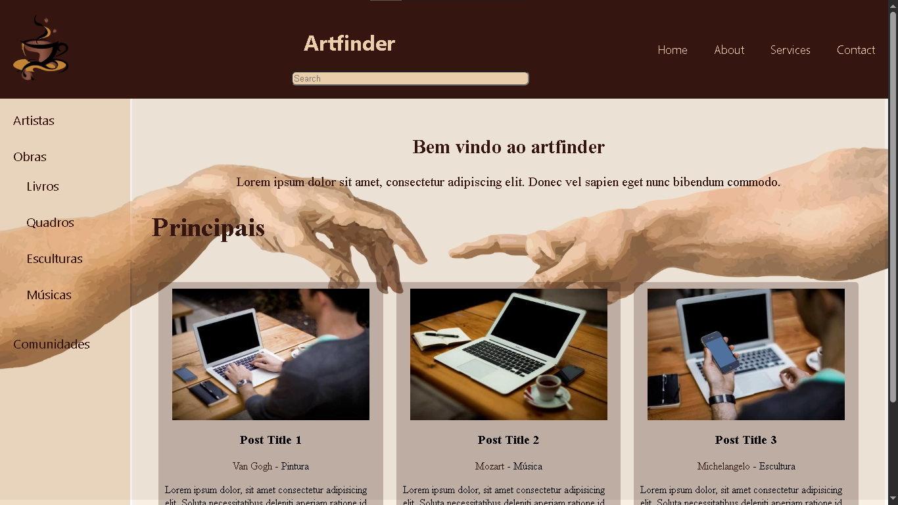

Pedro henrique Silva Oliveira
matriícula - 927165

Foi escolhido a primeira proposta de criação para fazer a tarefa 4 a respeito do wireframe

proposta de criação de um site que abange os artistaas e suas obras como uma rede social
nome> Artfinder

prints:
    wireframe: 
    
    Home page: tarefa-iv-Unlikeanypedro/e2fe3664-5ff5-4720-ac83-0e4996eb6350.png